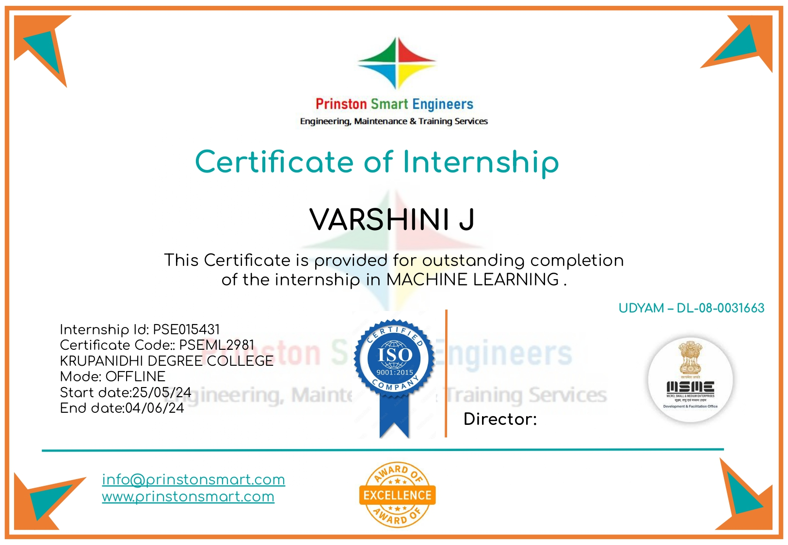

# Vehicle CO2 Emissions Prediction
> A technical analysis and implementation of machine learning models for environmental impact forecasting. Developed during a professional internship at Prinston Smart Engineers.

---

## 🔗 Live Deployment
**Check out the live application here:** https://carbon-pulse.onrender.com

## 📺 Project Demonstration
<div align="center">
  <video src="https://github.com/user-attachments/assets/53c99275-25bd-420a-bda3-ab48cf166054" width="100%" controls>
    Your browser does not support the video tag.
  </video>
</div>

## Project Overview
This project focuses on the development of a predictive system to estimate CO2 emissions from light-duty vehicles. By leveraging historical fuel consumption and vehicle specification data, we implement regression-based machine learning models to provide accurate, data-driven environmental assessments.

This was an individual project conducted under the guidance of **Prinston Smart Engineers**.

---

## Problem Statement
Accurately measuring vehicle emissions through physical testing is resource-intensive. The objective of this project is to build a computational model that predicts CO2 emissions (g/km) using accessible vehicle specifications such as engine displacement and fuel efficiency metrics.

---

## Dataset Analysis
The model is trained on the **2019 Fuel Consumption Dataset** for light-duty vehicles. The following features were identified as core predictors:
- **Engine Size (L)**: Total volume of all cylinders in the engine.
- **Fuel Consumption (City/Hwy/Comb)**: Liters of fuel consumed per 100 km under various driving conditions.
- **CO2 Emissions (g/km)**: The target variable for supervised learning.

---

## Technical Stack & Tools
The following technologies were utilized to build the end-to-end pipeline:

### 1. Data Analysis & Modeling
- **Python**: The primary programming language used for the entire machine learning pipeline.
- **Pandas & NumPy**: Utilized for data cleaning, handling missing values in engine specifications, and performing numerical transformations.
- **Scikit-learn**: Used to implement Linear Regression and Random Forest Regressor models, providing a robust framework for evaluation metrics.
- **XGBoost**: Employed to achieve high-precision regression results through optimized gradient boosting.

### 2. Backend & API
- **Flask**: A lightweight WSGI web application framework used to deploy the trained model as a RESTful API.
- **Pickle**: Used for serializing and de-serializing the trained XGBoost model to ensure efficient reloading during inference.

### 3. Frontend Dashboard
- **HTML5 & Vanilla CSS**: Used to design a responsive, high-fidelity user interface.
- **JavaScript (ES6)**: Handles asynchronous API calls to the Flask backend and manages real-time data visualization via the Canvas API.

---

## Model Evaluation and Results
Multiple algorithms were evaluated to determine the most effective predictor. Scores are based on the R2 metric and Mean Absolute Error (MAE).

| Model | R2-Score | Error (MAE) |
| :--- | :--- | :--- |
| **XGBoost Regressor** | **0.97** | **3.43** |
| **Random Forest** | **0.97** | **3.61** |
| **Linear Regression** | 0.84 | ~10.2 |

### Performance Analysis
While both Random Forest and XGBoost achieved an R2 score of 0.97, the **XGBoost Regressor** was selected as the production model due to its superior precision, evidenced by a significantly lower **Mean Absolute Error (3.43 g/km)**.

---

## Execution Guide

### Prerequisites
- Python 3.8+
- Required libraries: `pip install flask flask-cors xgboost pandas openpyxl`

### Step 1: Model Generation
1. Open `project-code.ipynb` in your preferred editor (Jupyter/VS Code).
2. Execute all cells to perform data cleaning and model training.
3. Ensure the final cell is executed to export the model:
   ```python
   import pickle
   with open("backend/co2_model.pkl", "wb") as f:
       pickle.dump(xgb_4, f)
   ```

### Step 2: Backend Deployment
1. Navigate to the `backend/` directory.
2. Start the Flask server:
   ```bash
   python app.py
   ```
3. The server will initialize at `http://127.0.0.1:5000`.

### Step 3: Frontend Access
1. Navigate to the `frontend/` directory.
2. Open `index.html` in a web browser.
3. Input the required vehicle specifications to receive real-time CO2 predictions.

---

## Developer
**Varshini J**

[](https://github.com/varshinijayaprabhu)
[](https://www.linkedin.com/in/varshinij2004/)
[](mailto:varshini.j.512004@gmail.com)

### 📜 Certification

